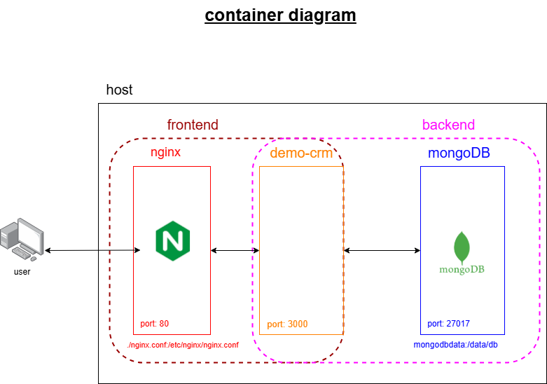

# CI/CD for Demo-Crm Application

This project demonstrates the implementation of a CI/CD pipeline for a Node.js-based ticketing application

## Table of Contents

- [Overview](#overview)
- [Architecture](#architecture)
- [Technology Stack](#technology-stack)
- [Prerequisites](#prerequisites)
- [Getting Started](#getting-started)
- [Contact](#contact)

## Overview

Implemented a robust CI/CD pipeline for the Demo-CRM application (a ticketing system written in Node.js). The pipeline integrates:
- [ArgoCD for automated deployment]
- [Docker for containerization]
- [Helm charts for Kubernetes deployment]

The application is deployed onto an AWS EKS cluster, with infrastructure provisioned and managed using Terraform, ensuring scalability, high availability, and automated infrastructure management.

## Architecture

As shown in the diagram, the application consists of three containers:
- MongoDB - The database container that stores application data 
- Demo-CRM Application - The main backend application running on port 3000.
- Nginx - Used as a reverse proxy to route incoming traffic to the Demo-CRM application.
  
**Network Segmentation** -
To enhance security, two separate Docker networks were created:
- frontend- Connects Nginx and Demo-CRM, allowing external users to access the application only through Nginx.
- badckend - Connects Demo-CRM and MongoDB, ensuring that the database is isolated from direct user access.

The user can only send requests to Nginx on port 80, preventing direct access to the backend services.
MongoDB is not exposed to external requests, making the system more secure.
The separation between frontend and backend networks ensures better security.

## Technology Stack

| Category             | Technologies   |
| -------------------- | -------------- |
| **Infrastructure**   | K8S |
| **Containerization** | Docker and Docker compose |
| **CI/CD**            | github action |
| **Security**         | Use Secrets and diffrent networks |
| **Application**      | Node.js |
| **Database**         | MongoDB |

## Prerequisites

Requirements for building and running the project:

- Demo-crm Application
- AWS user to create ECR and EKS 
- Terraform modle to create EKS
- docker and docker compose installed

## Getting Started

Follow these instructions to set up the project locally and deploy it to your cloud environment.

### Infrastructure Setup

1. **create ECR**

in AWS user create ECR at the required region

2. **create EKS cluster**

run: terraform apply to with the cluster create modle 

## Contact

Idan Raviv - [LinkedIn](https://www.linkedin.com/in/idan-raviv-bb8183207/) - [idanraviv1993@gmail.com](idanraviv1993@gmail.com)

Project Link: [https://github.com/idrr1993/Application](https://github.com/[idrr1993]/[Application])

